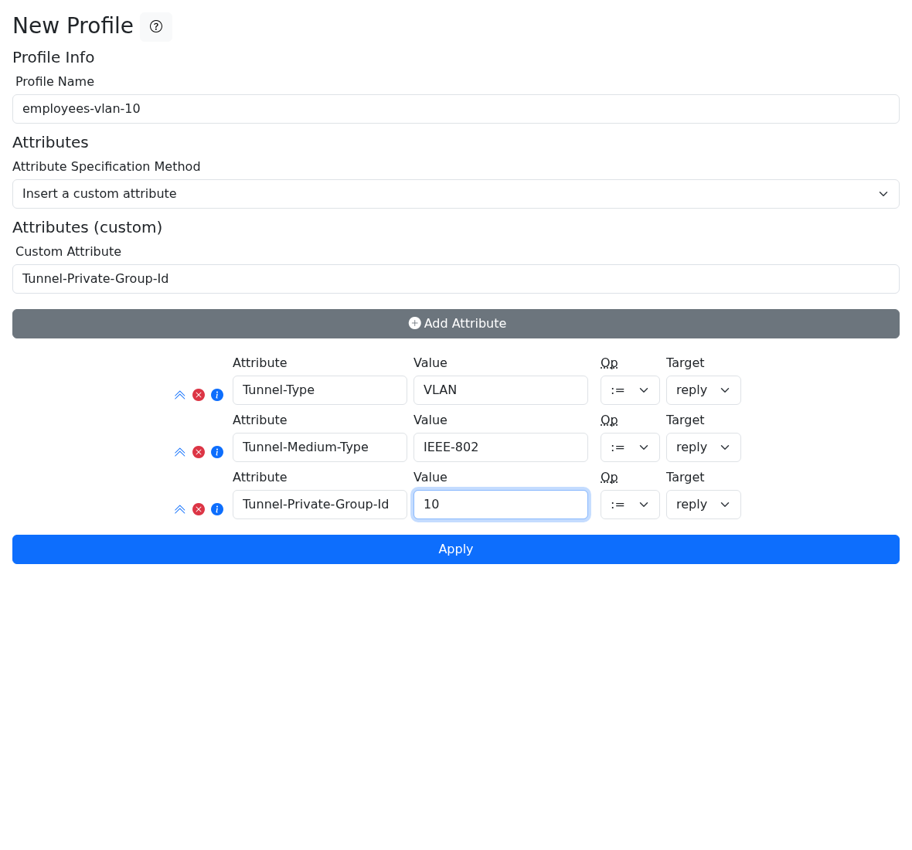
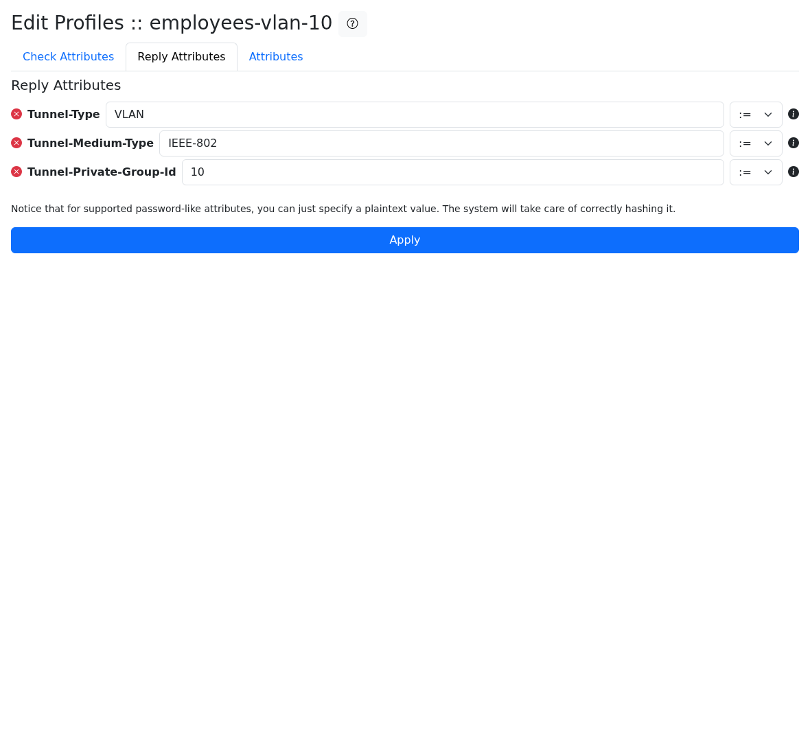
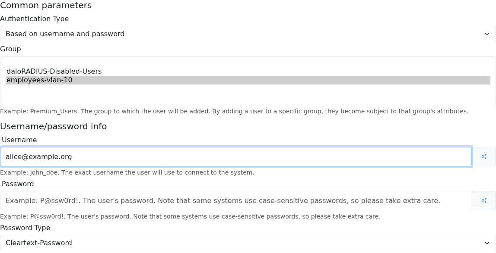

# Dynamic VLAN assignment with daloRADIUS

This guide configures a VLAN as a RADIUS reply for a user through a daloRADIUS profile. The example assigns VLAN `10` to members of the `employees-vlan-10` profile.

Dynamic VLAN assignment also requires support and configuration on the wireless access point, controller, or switch. daloRADIUS stores the authorization data; FreeRADIUS evaluates it and returns the VLAN attributes to the NAS.

## Before you start

You need:

- a working daloRADIUS and FreeRADIUS installation using the same SQL database;
- the FreeRADIUS SQL module enabled in the `authorize` section;
- a RADIUS client/NAS already authorized by FreeRADIUS;
- VLAN `10` created and allowed on the relevant AP, controller, and switch ports;
- access to the daloRADIUS operators interface.

The examples use the standard FreeRADIUS SQL table names. If they were changed in `daloradius.conf.php` or the FreeRADIUS SQL module, adapt the queries accordingly.

## Understand where the attributes are stored

FreeRADIUS separates conditions from replies and user-specific data from group data:

| Table | Purpose |
| --- | --- |
| `radcheck` | Conditions and credentials for one user |
| `radreply` | Reply attributes for one user |
| `radusergroup` | User-to-group/profile membership and priority |
| `radgroupcheck` | Conditions that must match before a group is applied |
| `radgroupreply` | Reply attributes for members of a group/profile |

A daloRADIUS profile uses the group tables. Therefore, the VLAN attributes created in this guide are stored in `radgroupreply`, while the user-to-profile association is stored in `radusergroup`. It is normal for `radreply` to remain empty.

> [!IMPORTANT]
> Do not add the VLAN reply attributes to `radgroupcheck`. They are values that FreeRADIUS must return in the `Access-Accept`, not conditions normally present in the `Access-Request`. Putting them in `radgroupcheck` can prevent the profile's reply attributes from being applied.

## 1. Create the VLAN profile

1. Open **Management → Profiles → New Profile**.
2. Enter `employees-vlan-10` as the profile name.
3. Select **Insert a custom attribute**.
4. Add the following attributes:

   | Attribute | Value | Op | Target |
   | --- | --- | --- | --- |
   | `Tunnel-Type` | `VLAN` | `:=` | `reply` |
   | `Tunnel-Medium-Type` | `IEEE-802` | `:=` | `reply` |
   | `Tunnel-Private-Group-Id` | `10` | `:=` | `reply` |

5. Check every **Target** field before applying the form. Attributes without a dictionary recommendation may initially default to `check`; change them to `reply`.
6. Select **Apply**.



`Tunnel-Private-Group-Id` is a string attribute. Use the VLAN identifier expected by the NAS, such as `10`, without adding SQL quotes to the value in the UI.

## 2. Verify the profile

Open **Management → Profiles → Edit Profile**, select `employees-vlan-10`, and open the **Reply Attributes** tab. The three attributes should appear with the `:=` operator.



The equivalent SQL data is:

```text
employees-vlan-10 | Tunnel-Type             | := | VLAN
employees-vlan-10 | Tunnel-Medium-Type      | := | IEEE-802
employees-vlan-10 | Tunnel-Private-Group-Id | := | 10
```

You can verify it without displaying user passwords or RADIUS shared secrets:

```sql
SELECT groupname, attribute, op, value
FROM radgroupreply
WHERE groupname = 'employees-vlan-10'
ORDER BY id;
```

No matching `Tunnel-*` rows should be required in `radgroupcheck` for this basic configuration.

## 3. Assign the profile to a user

For a new user:

1. Open **Management → Users → New User**.
2. Keep **Based on username and password** unless your deployment uses another authentication method.
3. Select `employees-vlan-10` in **Group**.
4. Enter the user's username, password, and appropriate password type.
5. Select **Apply**.



For an existing user, open the user edit page and associate the same profile in the group management section. If the user belongs to several groups, remember that FreeRADIUS evaluates `radusergroup.priority` in ascending order.

Verify the association with:

```sql
SELECT username, groupname, priority
FROM radusergroup
WHERE username = 'alice@example.org'
ORDER BY priority;
```

## 4. Test the RADIUS reply

Run the test from a host that FreeRADIUS recognizes as a RADIUS client. On a standard installation, localhost is often already configured, but confirm this before testing.

The following example reads the two passwords without storing them in shell history:

```bash
read -rsp "RADIUS user password: " RADIUS_USER_PASSWORD && printf '\n'
read -rsp "RADIUS client secret: " RADIUS_CLIENT_SECRET && printf '\n'

radtest alice@example.org "$RADIUS_USER_PASSWORD" 127.0.0.1 0 "$RADIUS_CLIENT_SECRET"

unset RADIUS_USER_PASSWORD RADIUS_CLIENT_SECRET
```

A successful response should contain all three attributes:

```text
Received Access-Accept
    Tunnel-Type:0 = VLAN
    Tunnel-Medium-Type:0 = IEEE-802
    Tunnel-Private-Group-Id:0 = "10"
```

An `Access-Accept` without these attributes means authentication succeeded but the VLAN authorization data was not added to the final reply.

## 5. Test with the real NAS

After `radtest` succeeds:

1. Enable RADIUS-assigned or dynamic VLANs on the AP, controller, or switch.
2. Confirm that VLAN `10` exists at every required layer.
3. Allow/tag VLAN `10` on the AP and switch uplinks as required by the vendor.
4. Authenticate a test device.
5. Confirm the assigned VLAN on both the NAS and the client network.

Vendor terminology varies. Common settings include **Dynamic VLAN**, **RADIUS-assigned VLAN**, **RADIUS VLAN override**, or **AAA override**.

## EAP, PEAP, and TTLS considerations

`radtest` normally exercises PAP and does not reproduce the complete EAP exchange used by enterprise Wi-Fi. If `radtest` returns the correct VLAN but the AP does not receive it, run FreeRADIUS in debug mode and inspect the final outer `Access-Accept`:

```bash
sudo freeradius -X
```

Depending on the EAP method and FreeRADIUS configuration, reply attributes created while processing the inner tunnel may need to be copied to the outer reply. On FreeRADIUS 3 deployments this can involve the EAP module's `use_tunneled_reply` setting or explicit `outer.session-state` handling. Use the debug output to confirm where the attributes are created before changing this configuration.

The daloRADIUS Docker image enables `use_tunneled_reply`. Package-based installations may retain the distribution's FreeRADIUS defaults.

## Troubleshooting

| Symptom | Check |
| --- | --- |
| `radreply` is empty | This is expected for a profile. Inspect `radgroupreply` and `radusergroup`. |
| Attributes appear in `radgroupcheck` | Edit or recreate them with **Target = reply**. |
| `Access-Accept` has no VLAN attributes | Check the user's `radusergroup` membership, group priority, SQL processing, and `radgroupreply`. |
| FreeRADIUS does not query group tables | Confirm that the SQL module runs in `authorize`. `read_groups` defaults to `yes`, but verify the active SQL module configuration. |
| `radtest` works but enterprise Wi-Fi does not | Inspect the EAP inner and outer replies with `freeradius -X`. |
| The AP receives VLAN `10`, but the client has no connectivity | Check VLAN creation, tagging, trunks, DHCP, routing, and firewall policy outside daloRADIUS. |
| FreeRADIUS reports `unknown client` | Add or correct the NAS/client definition. This is client authorization failure, not a VLAN attribute problem. |

Avoid adding a custom SQL query in `post-auth` to fetch the first group manually. The standard SQL module already handles group membership, priority, check items, reply items, and fall-through behavior. A custom `LIMIT 1` query can select the wrong group and bypass those semantics.

## References

- [FreeRADIUS SQL module and table processing](https://wiki.freeradius.org/modules/Rlm_sql)
- [FreeRADIUS SQL module configuration](https://networkradius.com/doc/current/raddb/mods-available/sql.html)
- [daloRADIUS issue #576](https://github.com/lirantal/daloradius/issues/576)
